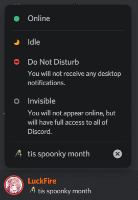

# GradientButtons-v2
Add some gradients to your buttons.

# Installation and Updating
For installation, go to **Themes -> Open CMD / Powershell / Terminal / Gitbash**, and enter the following:
```
git clone https://github.com/LuckFire/GradientButtons-v2
```

Powercords updater is currently broken, so in order to update the theme you will have to do it manually. To do it manually, go to **Themes -> GradientButtons-v2 -> Open CMD / Powershell / Terminal / Gitbash**, and enter the following:
```
git pull
```

# Previews




# Other Version
If you don't like the *fannnncy* transitions, then you're a loser. Just kidding, some people don't. Just incase there is someone out there who doesn't like the transitions that happen on hover, there is another version and it can be found here: https://github.com/

## NOTE: PLEASE READ THE README.md FOR INFORMATION ON INSTALLATION, IT IS DIFFERENT COMPARED TO THIS.
