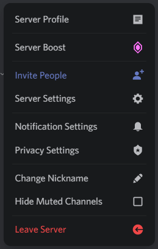

# GradientButtons (v2)
Add some spice to your buttons.. with gradients!




## Installation
For **[Powercord](http://powercord.dev/)** or **[Vizality](https://vizality.com/)** installation, **locate and head over to your themes folder, open a terminal of choice, and enter the following:**
```
git clone https://github.com/Discord-Theme-Addons/gradientbuttons-v2
```

**For [BetterDiscord](http://betterdiscord.app/):**
- [Direct Download](https://github.com/Discord-Theme-Addons/gradientbuttons-v2/releases/download/bd-download/GradientButtons.theme.css)
- [View Source](https://discord-theme-addons.github.io/gradientbuttons-v2/src/support/compiled.css)

**For [Stylus](https://github.com/openstyles/stylus):**
1. Install the Stylus extension for [Chrome](https://chrome.google.com/webstore/detail/stylus/clngdbkpkpeebahjckkjfobafhncgmne) / [Firefox](https://addons.mozilla.org/en-US/firefox/addon/styl-us/) / [Opera](https://github.com/openstyles/stylus/wiki/Opera,-Outdated-Stylus).
2. After installing, head over to [this link](https://discord-theme-addons.github.io/gradientbuttons-v2/src/support/GradientButtons.user.css).
3. Press the "Install Style" button.

## Disabling Transitions
If you dislike the transitions on hover, you can simply just disable them using the variables. Head over to the root and paste the following under `/* Transitions */`.
```css
:root {
  /* Transitions */
  --button-transition: none;
  --font-default: 500;
  --font-hover: var(--font-default);
  --fontsize-hover: 14px;
  --transform-normal: scale(1);
  --transform-hover: var(--transform-normal);
  --button-transform-hover: var(--transform-normal);
}
```

# Credits
A big thank you to everyone who helped with this!
- **[Hoofer](https://github.com/HooferDevelops)** for the original code, aka Gradient Buttons v1. He didn't publish the code, so I asked if I could with extra stuff.
- **[botato](https://github.com/bototo2)** for letting me know that I can use #id instead of [id=""].